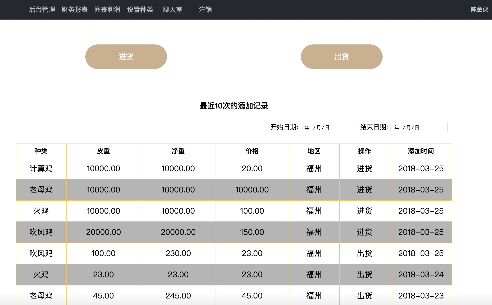
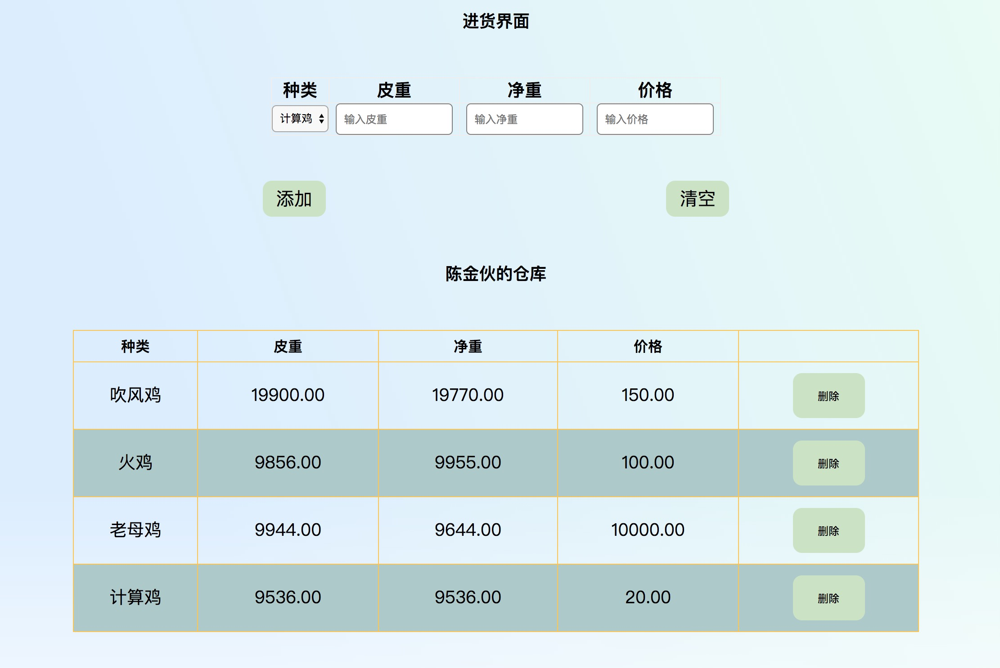
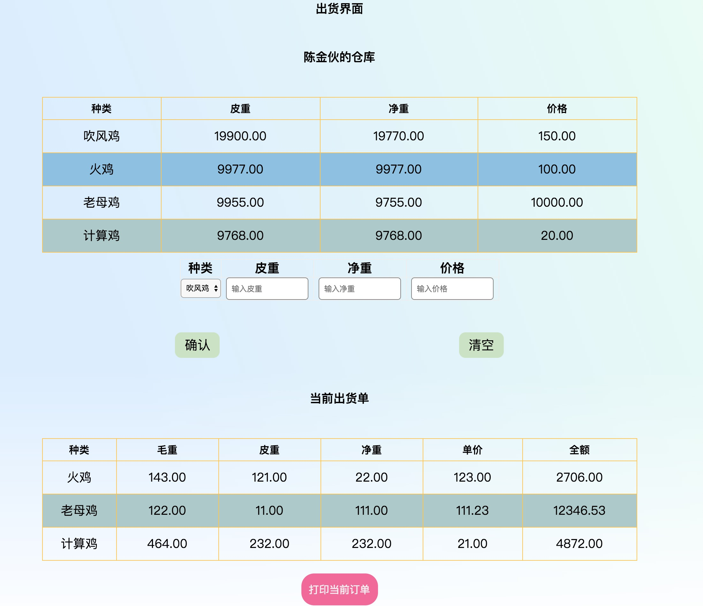
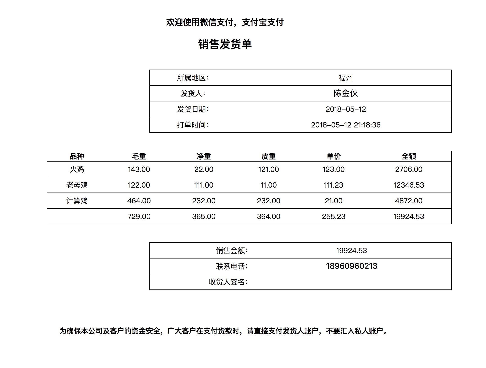
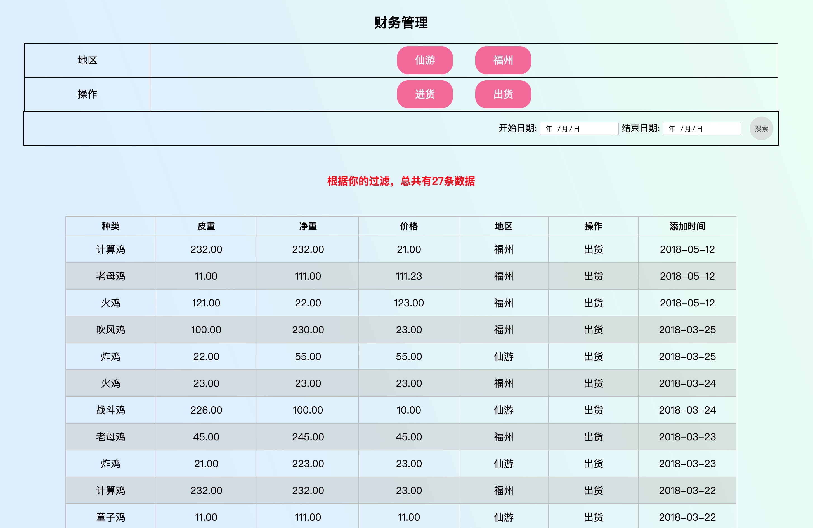
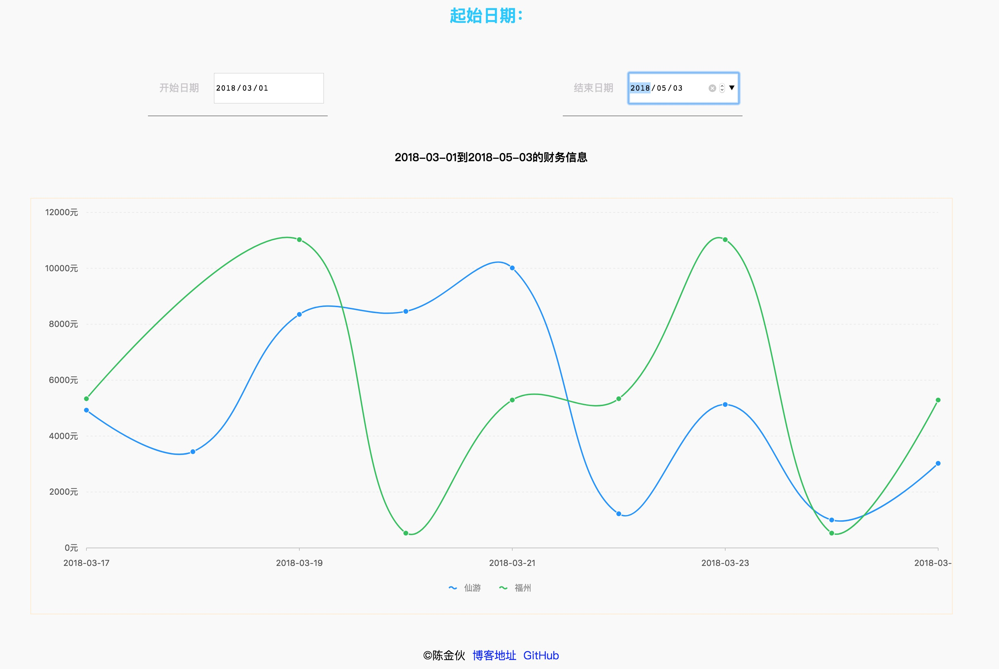
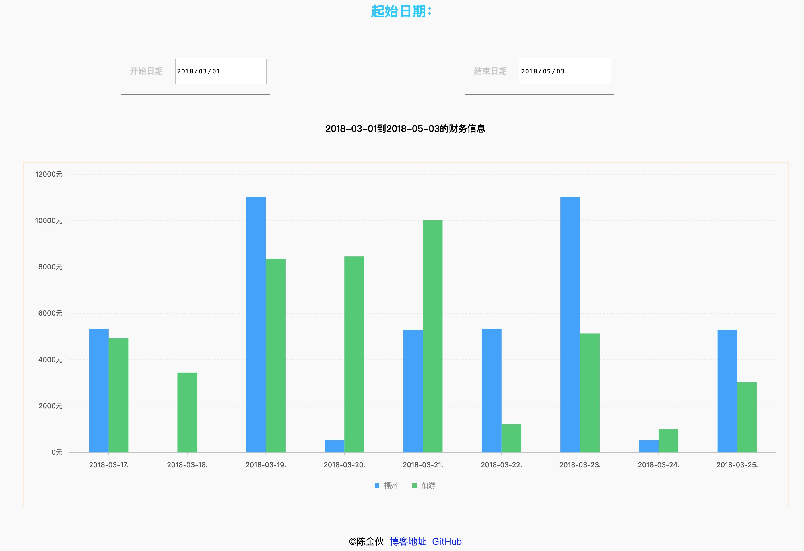
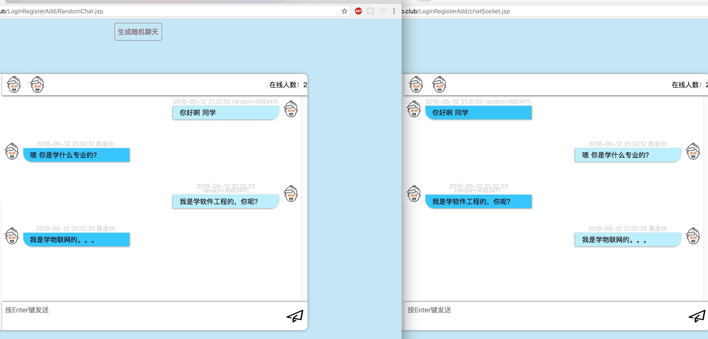

## Summary
网上系统主要功能有：为店主统计财务和打印出货单，网站有基本的增删改查功能，财务报表功能，数据可视化图表，多人在线聊天室。

#### 技术栈
```
前端：html+css+js+ajax+websocket
后端：Tomcat+JSP+Mysql
```
#### 项目运行
```
clone git git@github.com:TypeInfos/javaweb-ajax-websocket-mysql.git
将System.war导入到javaweb开发工具中，如果要放在linux中运行的话下面有个链接教程
sql文件：在MySql终端用:source System.sql
```
在阿里云买了香港的服务器（不用备案），配置linux的Apache+Tomcat环境：[配置环境教程](https://www.cnblogs.com/cyl048/p/6873124.html)，再配置https证书：[配置https教程](https://letsencrypt.org/)

###### 温馨提示：如果在已经配置完https的服务器上运行websocket要把new WebSocket("ws://localhost:8080...)的ws改成[wss](https://segmentfault.com/q/1010000007391137/a-1020000007391991)因为https是安全协议不允许不安全的wbsocket运行，所以再加个s表示secure，它是WebSocket的加密版本

系统管理思想：一个总店能管理各个分店，总店的权限是1，可以查看各个分店的操作记录，分店的权限是0只能查看自己的操作记录。
###  以下是主要界面
>首页 -> 主要用来显示本地最近的操作记录，可以根据上面的开始日期和结束日期来选择你想查看的某个时间段的操作记录。
>>

>进货 -> 进你需要的货物到仓库以便出货
>>

>出货 -> 前提是你的仓库里面的有的
>>

>打印订单 -> 可以用打印机打印出来，以便客户需要
>>

>财务报表 -> 可以根据进货、出货、地区、日期、来筛选记录
>>

>图表 -> 以图的形式来看各个地区的销售情况，更直观，当然还可以选择日期，每次选择日期都会异步刷新（基于G2）
>>
>>

>多人聊天室 -> 每个管理员都有自己的账号，都有对应的名字，所以可以在聊天室里面说说自己的情况，任何操作都是同时刷新，实时获取（基于websocket）
>>

>想看视频操作的话上面有个video文件夹，里面有操作该系统基本功能的视频

总结
--------------------
界面布局用的时间比较短，所以响应式不是很好，但细节其实挺多的，比如：为了防止短时间多次请求，用函数节流限制。为了让请求后端数据期间让页面看起来跟流畅，用过渡动画来优化用户体验...etc
